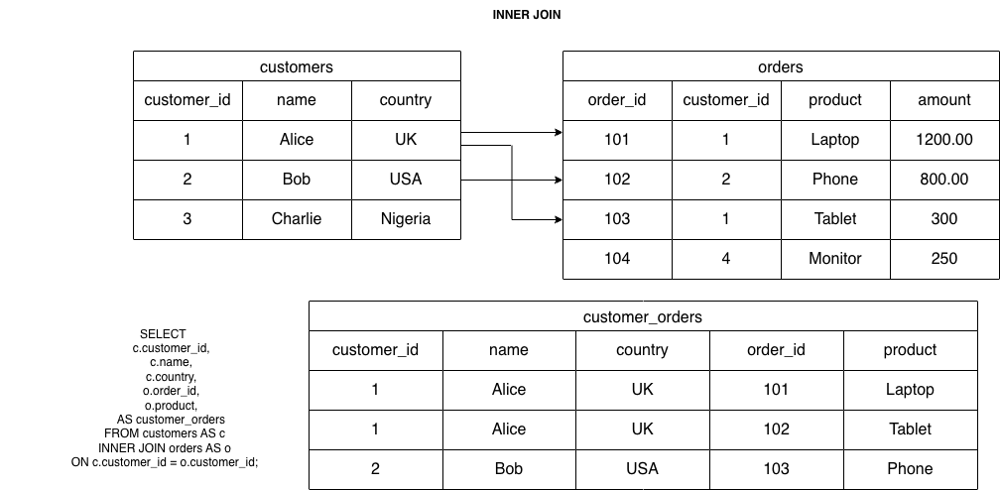

## INNER JOIN

- Action: Returns rows where there is a match between both tables based on a specified column (join condition).
- Result: Creates a table that includes only the rows with matching values in both tables. Rows without a match are excluded.


```sql
--- Inner Join of Countries that has president and prime_ministers, joining on country

SELECT cities.name , countries.name , countries.region
FROM cities
INNER JOIN countries
ON cities.country_code = countries.code;


--- Aliasing Tables
SELECT cities.name AS city, countries.name AS country , countries.region
FROM cities
INNER JOIN countries
ON cities.country_code = countries.code;


--- USING FUNCTION
SELECT cities.name AS city, countries.name AS country , countries.region
FROM cities
INNER JOIN countries
USING(country_code)

```